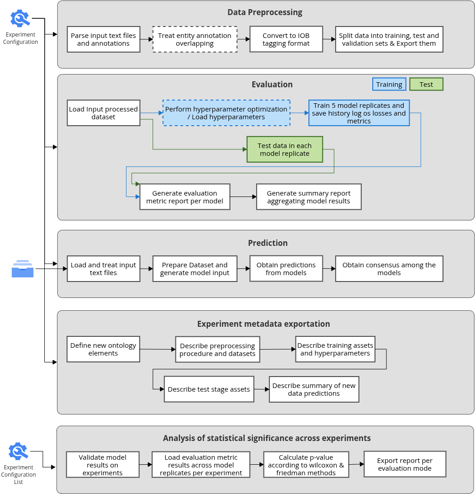

# NER Fair wf - Workflow to perform end-to-end named entity recognition experiments

Nextflow workflow to perform named entity recognition experiments handling since the dataset preparation step, the training by finetunning large language models, test, prediction and metadata enrichment describing all available about both the experiment itself and data generated/processed along the pipeline. It also allows for the models comparison across related experiments through p-value computation.

<div style="text-align: center">
	
</div>

## Summary

We have developed a comprehensive workflow with six functionalities: (1) Data transformation from a set of files paired as docid.ann (entity annotation) and docid.txt (respective plain raw text); (2) Training with possibility of choosing the llm model to finetune, option of reusing a json hyperparameter file, perform hyperparameter search or just using pre-defined hyperparameter values; (3) Test using the test split part that was processed in (1) or test using a custom external dataset (transformers compatible); (4) Prediction from a folder of plain raw txt files, producing a consensus list of annotations containing only those that model replicates agreed with a minimum mean score of 0.8; (5) Experiment metadata exportation, in which the experiment metadata provided in the configuration file plus the information processed/generated along the workflow execution will be described with our proposed ontology elements for NLP experiments; (6) Analysis of significance across scope-related experiments, supporting the stratification per entity or calculating the global significance per evaluation metric (f1-score, accuracy, precision, etc.), according to the following illustration.
<div style="text-align: center">
	
</div>

## Requirements:
* The packages are stated in the environment's exported file: environment.yml

## Usage Instructions
### Preparation:
1. ````git clone https://github.com/YasCoMa/ner-fair-workflow.git````
2. ````cd ner-fair-workflow````
3. ````conda env create --file environment.yml````
4. The workflow requires four parameters, you can edit them in main.nf, or pass in the command line when you start the execution. The parameters are:
	- **mode**: Indicates the goal of the workflow: 'preprocess', 'training', 'test', 'prediction', 'metadata_enrichment' or 'significance_analysis'. It activates accordingly the steps according to the mode.
	- **dataDir**: The directory where the execution logs will be stored together with the marker files to track the modules already executed.
	- **runningConfig**: A json file with the configuration setup desired by the user. Each main key of the json file is explained below.
		- **outpath**: Path to the directory where the workflow modules will store the results. Mandatory. Example: ``./validation_ctpico_out``

		- **identifier**: Experiment identifier. Mandatory. Example: "biobert-merged_train-hypersearch"
		
		- **pretrained_model**: Pre trained LLM model that will be used for fine-tunning. Mandatory. Example: "dmis-lab/biobert-base-cased-v1.2"
		
		- **target_tags**: Path to the json file containing an array of NER target tags. Mandatory. Example: "./target_tags.json" , example of this json content: ["O", "B-DiseaseClass", "I-DiseaseClass", "B-SpecificDisease", "I-SpecificDisease"]

		- **config_hpc**: Path to the json file containing the cluster access information to launch jobs. Check more details about it in the "HPC execution configuration" section.  Example: ``./config_hpc.json``
		
		- **seed**: Seed value to control randomness in libraries. Default value: 42.
		
		- [Only preprocess mode] **data_text_path**: Path to the folder where the raw .ann and .txt files are located. Mandatory for preprocessing. Example: "./raw_input_wf_data"
		
		- [Only preprocess mode] **eliminate_overlappings**: Flag to activate the overlapping elimination across the annotations. Default value: true
		
		- [Only training or test mode] **report_summary_stats_metric**: Statistical aggregation function to summarize evaluation metric values from model replicates. Default value: median. Possible values: ['max', 'min', 'mean', 'median', 'std']
		
		- [Only training mode] **do_hyperparameter_search**: Flag to activate the hyperparameter search. Default value: false
		
		- [Only training mode] **hyperparameter_path**: Path to a custom pickle file containing hyperparameter values. If a valid path is specified the module will use it even if the hyperparameter search flag is turned off. Example: "./best_params.pkl"
		
		- [Only training mode] **optimization_metric**: Evaluation metric that will be used in the objective function for maximization in the hyperparameter search. Default value: "f1". Possible values: ['f1', 'precision', 'recall', 'accuracy']
		
		- [Only training mode] **test_data**: Information regarding a custom data that you want to use as test dataset rather than the test split generated in the preprocessing module. Example: 
		`"test_data": { 
            "identifier": "merged-test", 
            "path": "/aloy/home/ymartins/match_clinical_trial/nerfairwf_experiments/trials/biobert-merged_test-hypersearch-biobert-base-cased-v1.2-finetuned-ner/preprocessing/dataset_full_nosplit_v0.1", 
            "key": null 
        }`
			- identifier: a name used to identify the respective results in the evaluation reports.
			- path: Path to a transformers-compatible dataset or dataframe.
			- key: If the data is a dataframe, this parameter is used to identify the key to acess the Dataset inside the dataframe. If you do not specify it or specify with a null value, it you treat it as a dataset instance. Default value: "test"
		
		- [Only prediction mode] **input_prediction**: Path to the folder containing raw text files. Mandatory for prediction mode. Example: "./abstracts_txt/"
		
		- [Only metadata_enrichment mode] **experiment_metadata**: Experiment metadata with some details to describe the experiment. Example: 
		`"experiment_metadata": {
			"name": "NER benchmark for  dataset merged_train", 
			"domain": "NER for PICO entities in texts concerning clinical trials"
			"description": "",
			"source": ""
		}`
			- name: a title for the experiment. Default value: "NLP Experiment for named entity recognition - identifier"
			- domain: the scope of the NER experiment regarding the concepts of the entities. Default value: ""
			- description: a brief description about the experiment. Default value: ""
			- source: information about the original annotation data configured to train the model. Default value: ""
		
		- [Only significance_analysis mode] **external_eval_data**: Information concerning the external models (evaluators) results of the evaluation metrics for the same entities used in this experiment. Examples for the global and per entity options: 
		`"external_eval_data": { 
		    "mode": "per_entity",
		    "evaluators": [ 
		        { 
		            "identifier": "paper_12345", 
		            "level": "token", 
		            "results": { "age": { "f1-score": [0.8, 0.8, 0.8, 0.8], "accuracy": [0.9, 0.9, 0.9, 0.9, 0.9] }, "outcome": { "f1-score": [0.8, 0.8, 0.8, 0.8], "accuracy": [0.9, 0.9, 0.9, 0.9, 0.9] } } 
		        } 
		    ] 
		}` or `"external_eval_data": { 
		    "mode": "global",
		    "agg_function": "median",
		    "evaluators": [ 
		        { 
		            "identifier": "paper_12345", 
		            "level": "token", 
		            "results": { "age": { "f1-score": 0.8, "accuracy": 0.9 }, "outcome": { "f1-score": 0.8, "accuracy": 0.9 } } 
		        } 
		    ] 
		}`

            - mode: defines the granularity of the significance analysis. Mandatory. It accepts either "global" or "per_entity"
            - evaluators: specification of the evaluators list
                - identifier: a label to identify the evaluator in the reports
                - level: it defines in which level you want to compare the results. It accepts wither "word" or "token".
                - results: It defines the evaluation metics to be used and their respective values for each entity. In the global type, it expects a single float value whereas it expects an array of values in the per_entity type,

### Run workflow:
1. Examples of running configuration are shown in running_config.json and eskape_running_config.json

2. Modes of execution:
	- **Run All:**
		- ````nextflow run main.nf```` or ````nextflow run main.nf --dataDir /path/to/output_logs --runningConfig /path/to/running_config.json --mode all ````
	- **Run Pre-processing:**
		- ````nextflow run main.nf --dataDir /path/to/output_logs --runningConfig /path/to/running_config.json --mode preprocess ````
	- **Run Training:**
		- ````nextflow run main.nf --dataDir /path/to/output_logs --runningConfig /path/to/running_config.json --mode training````
	- **Run Test:**
		- ````nextflow run main.nf --dataDir /path/to/output_logs --runningConfig /path/to/running_config.json --mode test````
	- **Run Prediction:**
		- ````nextflow run main.nf --dataDir /path/to/output_logs --runningConfig /path/to/running_config.json --mode prediction````
	- **Run Metadata Enrichment:**
		- ````nextflow run main.nf --dataDir /path/to/output_logs --runningConfig /path/to/running_config.json --mode metadata_enrichment````
	- **Run Significance analysis:**
		- ````nextflow run main.nf --dataDir /path/to/output_logs --runningConfig /path/to/running_config.json --mode significance_analysis````

### Creating singularity image:
Alternatively, you can run the workflow inside a singularity image. In the container folder you will find the recipe (nermatchct.def) with the instructions to build the image. In this folder you will also find the setup.sh execution file that builds the sand box and the final image file.
You only need to change the variable LOCAL_REPO in line 6 of setup.sh to assign the full path to the container folder. Then you just have to run it:
 ````cd container/````
 ````./setup.sh````

### HPC execution configuration:
Although the workflow steps can be executed completely in a sequential mode. If you associate an HPC configuration file path in the running setup file using the "config_hpc" parameter, some sub steps will distribute tasks to array jobs and the execution time may decrease significantly depending on the amount of inut data.

There is an example of such hpc config. file (config_hpc.json) in this repository, and you have to configure its parameters. It needs all the parameters already structured in the example file, you just have to change following terms on it:
- \_tmpDir\_ : temporary directory path
- \_pathToImage\_ : path to the .simg file corresponding to the singularity image that was built following the instructions of the previous section
- \_hpcEnv\_ : type of hpc environment of the server (it expects either sge or slurm)
- \_hostIp\_ : IP address of the server/head node
- \_sshUser\_ : authentication user
- \_sshPass\_ : authentication password
- \_queueId\_ : queue identifier, if applicable
- \_nodeList\_ : specific nodes to which you want to send the job to compute, if applicable
- \_partition\_ : specific nodes partition, if applicable

For those terms that you want to leave empty just remove the replacer and let it as "''"
The build of the singularity image is mandatory to use the workflow in a cluster.

## Reference

## Bug Report
Please, use the [Issues](https://github.com/YasCoMa/ner-fair-workflow/issues) tab to report any bug.